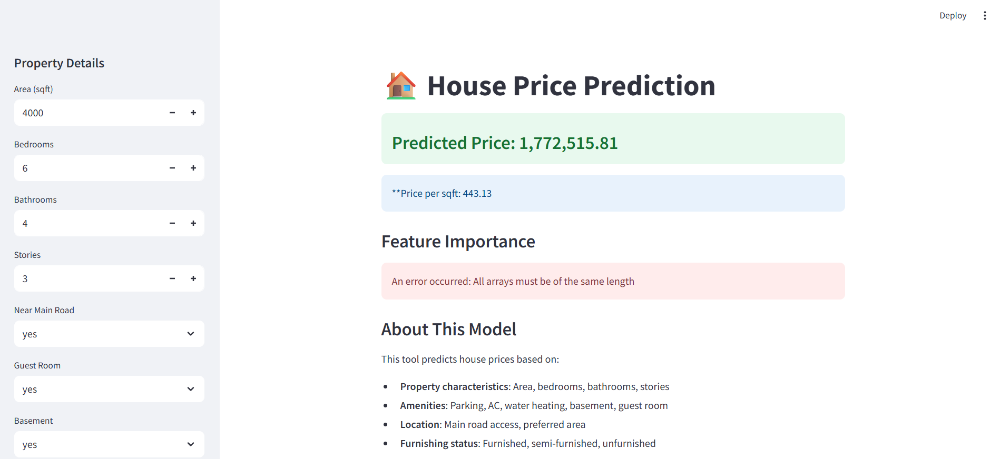

# 🏠 House Price Prediction App

A machine learning application that predicts property prices based on features like area, bedrooms, bathrooms, amenities, and location characteristics.



## Features

- Predicts house prices using Gradient Boosting algorithm
- Interactive web interface with sliders and input fields
- Displays price per square foot
- Shows feature importance
- Responsive design works on desktop and mobile

## Dataset Features

The model was trained on these property characteristics:
- **Numerical Features**: Area, Bedrooms, Bathrooms, Stories, Parking
- **Binary Features**: 
  - Main road access
  - Guest room
  - Basement
  - Hot water heating
  - Air conditioning
  - Preferred area
- **Categorical Feature**: Furnishing status (Furnished/Semi-Furnished/Unfurnished)

## Deployment Options

### 1. Streamlit Community Cloud (Recommended)

1. Fork this repository
2. Go to [share.streamlit.io](https://share.streamlit.io/)
3. Click "New app" and connect your GitHub account
4. Select repository and set main file to `app.py`
5. Click "Deploy"

Your app will be live at: `https://yourusername-house-price-app.streamlit.app`

### 2. Local Installation

```bash
    # Clone the repository
    git clone https://github.com/yourusername/house-price-prediction.git
    cd house-price-prediction
    
    # Create and activate virtual environment
    python -m venv venv
    source venv/bin/activate  # On Windows: venv\Scripts\activate
    
    # Install dependencies
    pip install -r requirements.txt
    
    # Run the app
    streamlit run app.py
```

## File Structure
```bash
    house-price-prediction/
    ├── app.py                 # Main Streamlit application
    ├── data_preparation.py    # Data loading and preprocessing
    ├── model_training.py      # Model training script
    ├── models/                # Trained model files
    │   └── tuned_gradient_boosting_model.pkl
    ├── requirements.txt       # Python dependencies
    └── README.md              # This file
```
## Requirements
- Python 3.7+
- Streamlit
- scikit-learn
- pandas
- numpy
- joblib

## Usage
1. Adjust the property details in the sidebar
2. Click "Predict Price"
3. View the estimated price and price per square foot
4. Examine feature importance to understand what factors affect the price most

## Example input
```json
{
    "area": 2000,
    "bedrooms": 3,
    "bathrooms": 2,
    "stories": 2,
    "mainroad": "yes",
    "guestroom": "no",
    "basement": "no",
    "hotwaterheating": "yes",
    "airconditioning": "yes",
    "parking": 1,
    "prefarea": "yes",
    "furnishingstatus": "furnished"
}
```
## Model Performance
| Metric | Value   |
|--------|---------|
| MAE    | $XX,XXX |
| RMSE   | $XX,XXX |
| R²     | 0.XX    |

## Contributing
1. Fork the project
2. Create your feature branch (git checkout -b feature/AmazingFeature)
3. Commit your changes (git commit -m 'Add some amazing feature')
4. Push to the branch (git push origin feature/AmazingFeature)
5. Open a Pull Request

# License
Distributed under the MIT License. See `LICENSE` for more information.
## 🔗 Contact
### Created by: Mina Bebawy
💼 [My Upwork Profile](https://www.upwork.com/freelancers/~01a15f0b82750ad98d)

💼 [My Fiverr Profile](https://www.fiverr.com/mena_bebawy)

📧 [E-mail](copperbox22@gmail.com)

